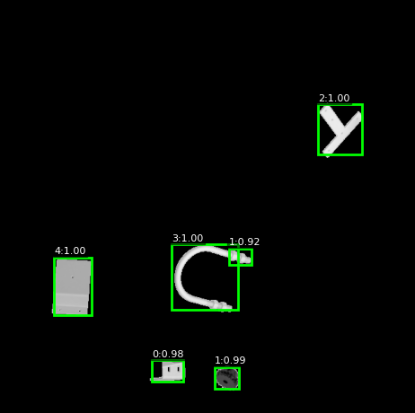

# 6 DoF Pose Model
This project presents a model for predicting the 6 Degrees of Freedom (6-DoF) required for robotic grasping using RGB-D imagery and associated camera intrinsics. The pipeline integrates object detection to localize objects via bounding boxes, followed by a pose prediction module that estimates position and orientation — (X, Y, Z, Roll, Pitch, Yaw) — for each detected object.


## Introduction

Accurate 6-DoF pose estimation for bin-picking is a fundamental challenge in industrial automation, where robotic systems must detect and localize objects in cluttered scenes for reliable grasping. Occlusion, object similarity, and varied poses make this a non-trivial perception problem, especially under real-time constraints.
Traditional methods using hand-crafted features and point cloud alignment often fail in dense scenes. Modern approaches leverage RGB-D inputs and deep learning to jointly exploit appearance and geometric cues for object detection and pose prediction.
In this project, I address the OpenCV Bin-Picking Challenge by developing a two-stage pipeline:

- **Object Detection:** RGB and depth images are processed through a custom detection pipeline to identify object bounding boxes.

- **Pose Estimation:** Using bounnding boxes, the RGB image are cropped then passed through a ResNet-18-based network, which extracts features and regresses the 6-DoF pose via sequential fully connected layers.

I explored several alternative approaches but ultimately chose this method due to computational and integration constraints. The final model balances performance and efficiency using standard RGB-D sensors and lightweight CNNs for end-to-end 6-DoF pose prediction.

<figure style="text-align: center;">
  
  <figcaption>Figure 1: Pipeline.</figcaption>
</figure>

## Dataset

The original dataset includes RGB, Depth, AOLP, DOLP, and mask images. However, its structure was not optimized for training, so a custom data loader was developed to efficiently feed data into the model.

### Custom Dataloader

Dataset Structure: 
```
DATASET_NAME
├─ camera[_CAMTYPE].json
├─ dataset_info.json
├─ test_targets_bop19.json
├─ test_targets_bop24.json
├─ [test_targets_multiview_bop25.json]
├─ models[_MODELTYPE][_eval]
│  ├─ models_info.json
│  ├─ obj_OBJ_ID.ply
├─ train|val|test[_SPLITTYPE]|onboarding_static|onboarding_dynamic
│  ├─ SCENE_ID|OBJ_ID
│  │  ├─ scene_camera[_CAMTYPE].json
│  │  ├─ scene_gt[_CAMTYPE]son
│  │  ├─ scene_gt_info[_CAMTYPE].json
│  │  ├─ scene_gt_coco[_CAMTYPE].json
│  │  ├─ depth[_CAMTYPE]
│  │  ├─ mask[_CAMTYPE]
│  │  ├─ mask_visib[_CAMTYPE]
│  │  ├─ rgb|gray[_CAMTYPE]

```
Custom Data Loader Structure:

```
DATASET_NAME
├─ Images
 ├─Dictoniary{RGB,Depth,AOLP,DOLP,Mask}
├─ Labels
 ├─Bounding Box values
├─ camera
├─ camera_transforms
 ├─Intrinsics values of camera
├─ R_6d
 ├─6 Degrees of Freedom
 

```

### Data Processing

Due to the large size of the original dataset, I selected a representative subset and partitioned it into training, validation, and test splits.

Each image in the training set contains approximately 10 to 30 objects, but hardware constraints — particularly limited GPU memory — prevented me from training on full scenes with many objects simultaneously. To address this, I utilized the mask images to generate a new dataset, where each training sample is constructed by randomly selecting 5 visible object masks per image. This allowed me to train efficiently while maintaining object-level diversity within the batch.


<div style="display: flex; justify-content: center; gap: 20px;">

<figure style="text-align: center;">
    
    <figcaption>Figure 2: Original RGB Image.</figcaption>
</figure>

<figure style="text-align: center;">
    
    <figcaption>Figure 3: Original Depth Image.</figcaption>
</figure>

</div>


<figure style="text-align: center;">
  
  <figcaption>Figure 4: Processed Data.</figcaption>
</figure>

### Data prep for pose prediction

From the selected 5 objects per image, each object is cropped and used as an input to the pose prediction model. The objective is to predict the 6 Degrees of Freedom (6-DoF) — consisting of position (X, Y, Z) and orientation (Roll, Pitch, Yaw).

The ground truth for each object is provided in the form of a rotation matrix and a translation vector. The rotation matrix is converted to Euler angles (Roll, Pitch, Yaw), and when combined with the translation vector, forms the complete 6-DoF pose representation.

Equations to get poses:
K = intrinsic camera , R = Rotation matrix , t = translation vector
X_World = 8 edge points of the object which I get using the 3d model of the object.

**pose=[tx​,ty​,tz​,roll,pitch,yaw]**

**projected_pts = K * [R|t] * X_world**


### Camera Intrinsic offset 

The camera intrinsics supplied with BOP describe a 3840 × 2160 sensor, while the cropped images are 2400 × 2400, so the principal point must be shifted before any pose work. I kept the focal lengths the same, subtracted the horizontal and vertical crop offsets from the original principal point and built a new 3 × 3 matrix K, which I save alongside each frame for later reprojection.

Code used for offsetting intrinsic
```
fx, fy, cx, cy = intr["fx"], intr["fy"], intr["cx"], intr["cy"]

orig_width = 3840
orig_height = 2160
new_width = 2400
new_height = 2400	 
offset = -70
# Cropping offset
crop_offset_x = ((orig_width - new_width) / 2) - offset  
crop_offset_y = (orig_height - new_height) / 2

cx_new = cx - crop_offset_x
cy_new = cy  - crop_offset_y
fx_new = fx
fy_new = fy

K = np.array([[fx_new, 0, cx_new],
          	[0, fy_new, cy_new],
          	[0,  0,  1]], dtype=np.float32)

```

**NOTE: Due to this offset, the 6D pose prediction is slightly off which made the 6D pose prediction model inaccurate.**


<figure style="text-align: center;">
  
  <figcaption>Figure 5: Inaccurate 6D Pose estimate.</figcaption>
</figure>


## Training 


### YOLO Fusion model
I trained the detector by extending the standard YOLO pipeline so that both the RGB image and the aligned depth map pass through the early layers of the backbone in parallel, then I concatenate the two feature tensors and feed them into the rest of YOLO’s backbone, neck and detection head.

To shorten training I imported the weights from the official baseline solution that already predicts one object among the 10 object types present in the dataset; layers whose shapes match were copied directly, giving a strong starting point and faster convergence on my limited GPU.


<figure style="text-align: center;">
  
  <figcaption>Figure 6: YOLO 11 Architecture.</figcaption>
</figure>

<figure style="text-align: center;">
  
  <figcaption>Figure 7: Custom YOLO 11 Architecture.</figcaption>
</figure>


#### Loss and Decoder

YOLO11 Loss class is a module that turns model outputs into a single training loss. It scores each object by three parts: class prediction with binary-cross-entropy (BCEWithLogitsLoss), distance distribution with distribution-focal loss (DFL), and box overlap with CIoU. These parts are weighted, summed, averaged, and returned for back-propagation.

decode_and_nms turns the network’s three output maps into final detections. It converts class logits to probabilities, recovers box edges by taking the expected value of distance bins, builds boxes around each grid cell, keeps those above a confidence threshold, merges all scales, applies IoU-based non-maximum suppression, and returns the remaining boxes.


### Pose Prediction Model

After each object is detected, I crop its RGB patch and send it through a lightweight ResNet-18 model. The resulting feature vector flows into two fully connected layers that output roll, pitch, yaw and three translation values. Targets come from the ground-truth rotation and translation matrices, with rotations converted to Euler angles so the network can regress six continuous numbers. I apply the updated camera intrinsic matrix before reprojection to make sure the predicted poses align with the annotations.

<figure style="text-align: center;">
  
  <figcaption>Figure 8: Resnet 18 Architecture.</figcaption>
</figure>


## Results

### Object Detection model

The training curves show rapid convergence—most gains occur within the first ten epochs, after which improvements taper off—so I concluded training at 25 epochs. Moreover, the model consistently achieves mAP scores of 0.40 and above.

<figure style="text-align: center;">
  
  <figcaption>Figure 9: Object Detection Model Loss and Map Plots.</figcaption>
</figure>

### Pose Predition model

The Pose model shows overfitting to the training data but due to camera intrinsics data constrains, I though it was futile to continue improving the model as the dataset itself is not correctly made. I might come back to this project to get the correct 6 Degrees of Freedom and retrain to validate if this is a suitable model to predict 6DoF.

<figure style="text-align: center;">
  
  <figcaption>Figure 10: 6 DOF Pose Model Loss Plot.</figcaption>
</figure>


### Combined Results

Here is just a result from the test dataset showcasing it's combined performance.

<div style="display: flex; justify-content: center; gap: 20px;">

<figure style="text-align: center;">
    
    <figcaption>Figure 11: Original RGB Image.</figcaption>
</figure>

<figure style="text-align: center;">
    
    <figcaption>Figure 12: Original Depth Image.</figcaption>
</figure>

</div>
